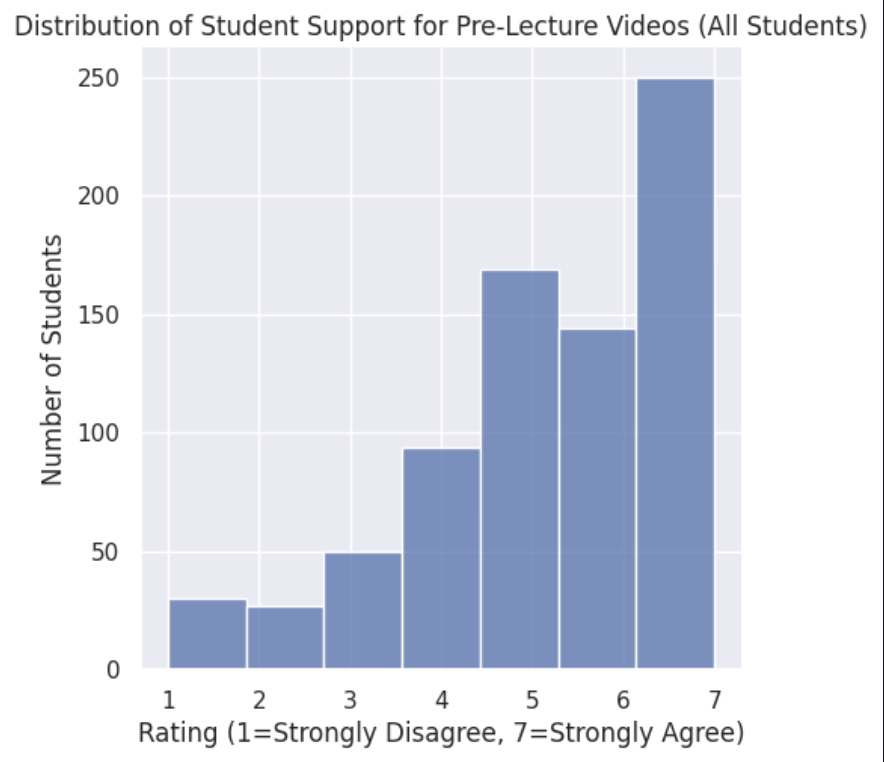
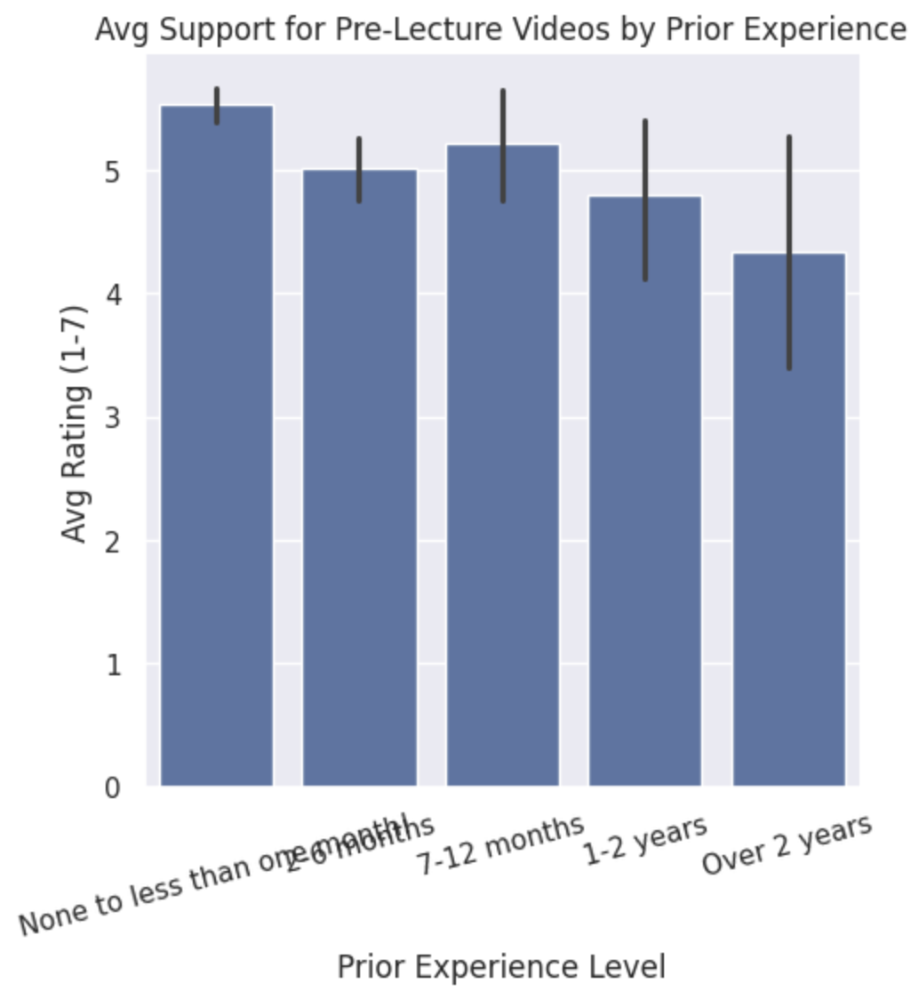
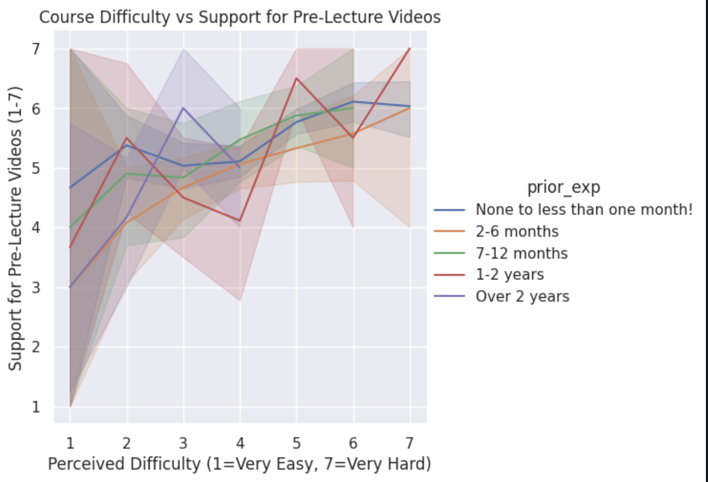

---
# Do not edit the text between these lines!
layout: default
---

# Comp110: To add pre-lecture videos?

## Analysis
Our analysis investigated if students with little prior experience who find difficutly understanding the course material would find pre-lecture videos helpful. We predicted that pre-lecture videos would be a beneficial addition to the course and sought to support this hypothesis with the data collected from the class. The data that we visualized with the three graphs above generally supports this idea. As indicated by the first graph, all students trended towards agreement (in the 5-7 range) for implementing pre lecture videos, regarless of experience level and difficulty in the class. The next plot was a histogram which further supports that students with less coding experience had a modestly higher average rating in favor of pre-lecture videos. Finally, the last graph incorporates the perceived difficulty rating and somewhat supports the claim that students who perceive the class as more difficult are in more in favor of pre-lecture videos, but not dramatically different across experience levels.

## Student Data:
Support for pre-lecture videos from ALL students:

Support for Pre-Lecture Videos based on Prior Experience:

Support for Pre-Lecture Videos based on Perceived Difficulty:

## Conclusion
 Given that our analysis generally supports our idea, we recommend that short pre-lecture videos that briefly introduce the important concepts of the upcoming lessons are posted for all students and are highly encouraged, especially for those with little prior experience who are finding the course difficult. This could also be useful for students to go back and reference while studying to focus on the most important points from each lesson.
Some potential costs of this recommendation include primarily the time and effort requirement of instructors to actually create these videos. This could add a significant workload at least for the first year of implementation. However, after the first year the videos could likely be reused with maybe a few edited as necessary. Additionally, having required pre-lecture videos could feel redundant and unecessary to experienced coders, which is why we suggest that these videos are optional. Another potential draw back of this suggestion is that students feel like they can rely on these videos and attendence is negatively impacted. 
For future work, if this idea is implemented the class performance can be compared to previous years to assess if the videos are improving performance, and surveys could be utilized to track viewership. Refining the idea, videos could be made for specific lessons that students struggle with so it remains a tool for better understanding and is less time-intensive for the instructional team

<!-- This is a comment. Below, you'll see code for inserting an image. To make this image appear, update <custom-path>. To add an image, save it inside the imgs folder of this repository. -->
/static/imgs/logo.png" alt="Image of Comp110 rainbow logo. "  width="500"/>
